- 2022 基于SpringBoot/SSM的酒店管理系统，已对接支付宝沙箱支付
- 预览地址：[http://atoli.liuyanzhao.com](http://atoli.liuyanzhao.com) （账号admin/123456）
- 详细介绍地址：[https://liuyanzhao.com/shop/atoli.html](https://liuyanzhao.com/shop/atoli.html)
- 代码地址：https://github.com/saysky/atoli 或 https://gitee.com/saysky/atoli
- 完成时间：2022年5月

# 一、功能介绍
- 包括管理员、前台工作人员、保洁阿姨、客户 四种角色
- 主要包括如下功能：
## 客户功能如下
- 1. 客户注册、登录、找回密码
- 2. 留言板查看和留言
- 3. 浏览客房，根据入住日期和退房日期查询和预定客房
- 4. 支付订单，支付已对接了支付宝沙箱支付，可可以随时关闭启动
- 5. 客户可以退房，续订，取消订单等功能

## 管理员功能如下
- 1. 客房管理
- 2. 客房类型管理
- 3. 订单管理
- 4. 入住登记管理
- 5. 退房登记管理
- 6. 客房清洁管理
- 7. 留言管理（只有管理员可以进行留言删除）
- 8. 财务管理
- 9. 人员管理（	前台人员，清洁人员，客户）
- 10. 角色管理，权限管理

## 酒店前台人员
- 1. 订单管理
- 2. 入住登记管理
- 3. 退房登记管理
- 4. 客房清洁管理（只能查看）
- 5. 留言管理，（可以留言回复，不能删除留言）
- 6. 财务管理
- 7. 人员管理（	只能看客户）

## 保洁人员
- 1. 客房清洁管理（可以点击开始打扫和完成打扫）

# 二、技术组成
- 1、SpringBoot 
- 2、MyBatis / MyBatis Plus
- 3、Thymeleaf
- 4、Bootstrap
- 5、MySQL

# 三、项目截图
具体请在预览网站查看

1-首页.png
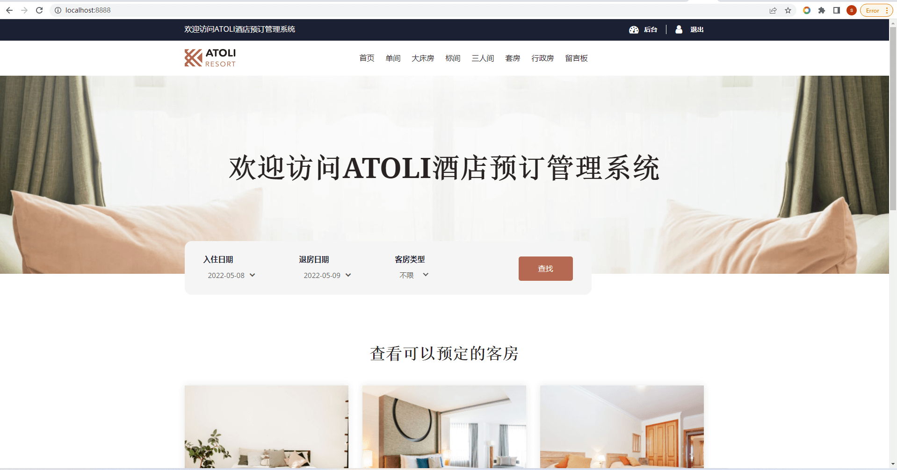
2-首页2.png

3-客房详情1.png
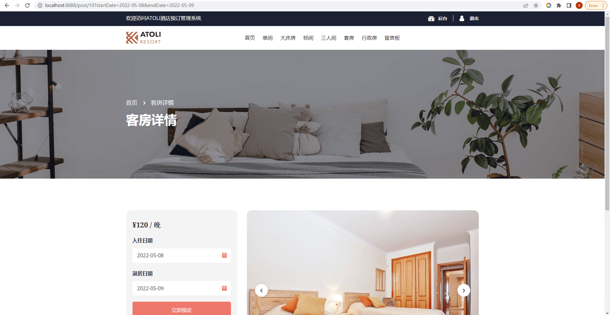
4-客房详情2.png
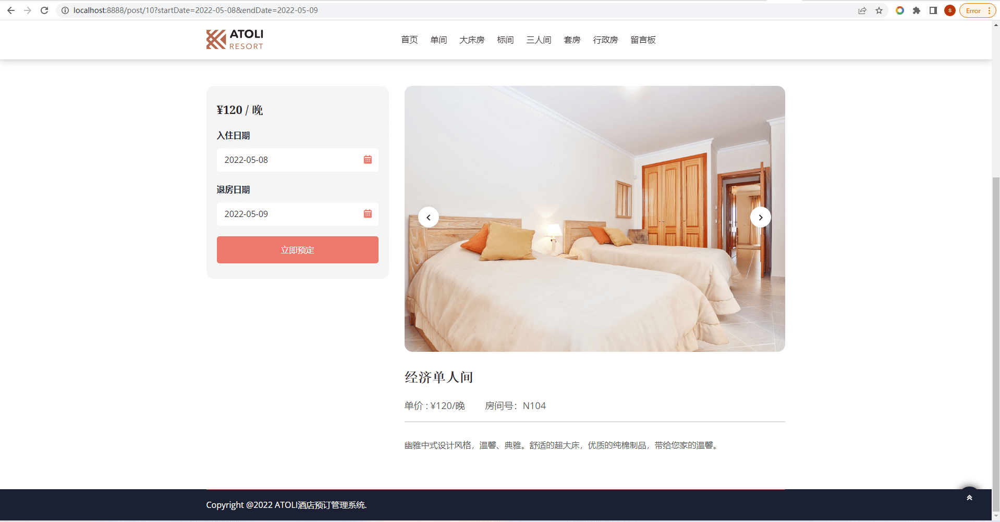
5-留言板1.png

6-留言板2.png

7-登录页面.png
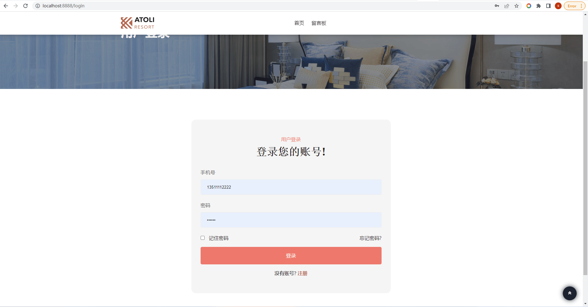
7-订单结算.png
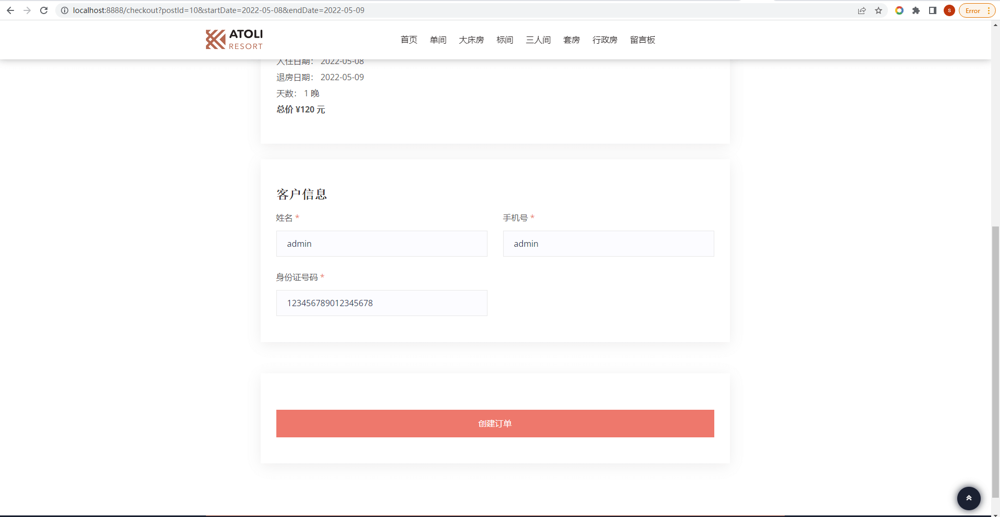
9-支付宝沙箱支付(可开启和关闭).png
.png)
10-支付成功.png

11-客户后台.png
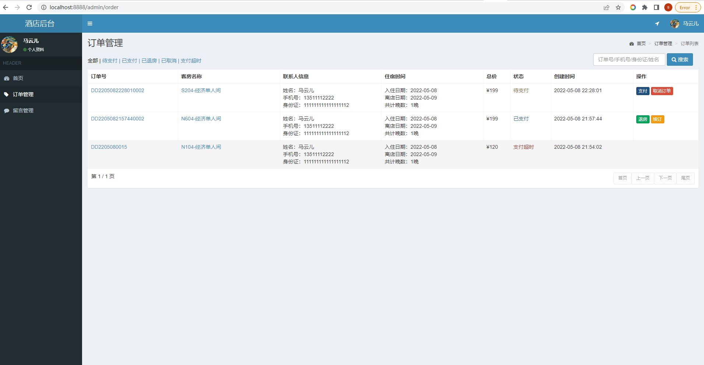
12-管理员后台订单管理.png
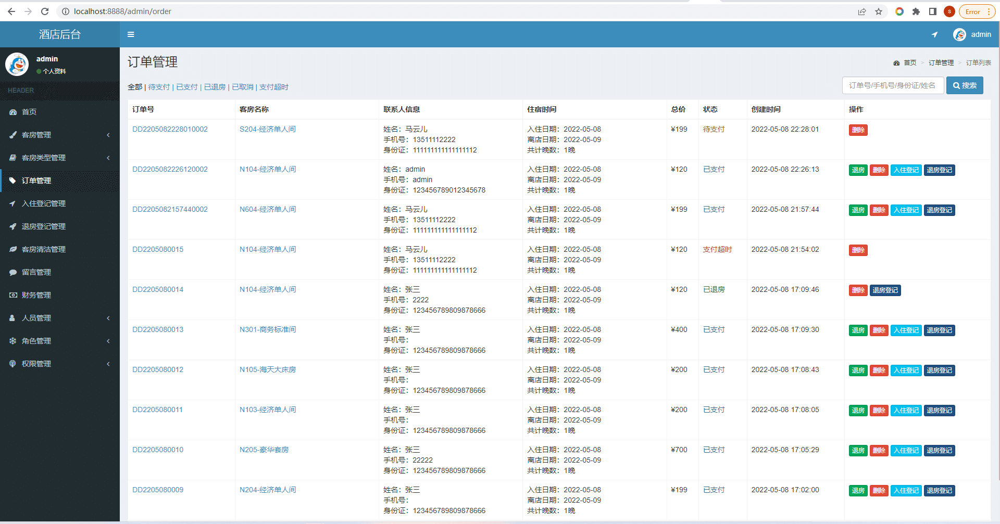
13-客房管理.png
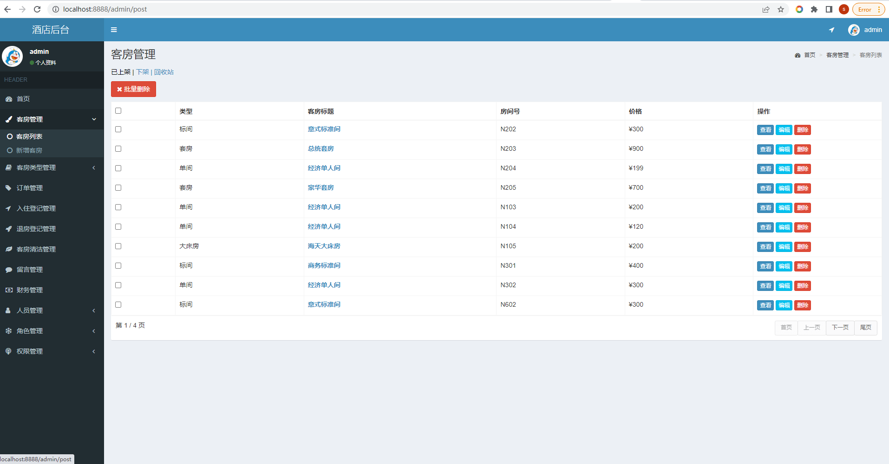
14-入住登记管理.png
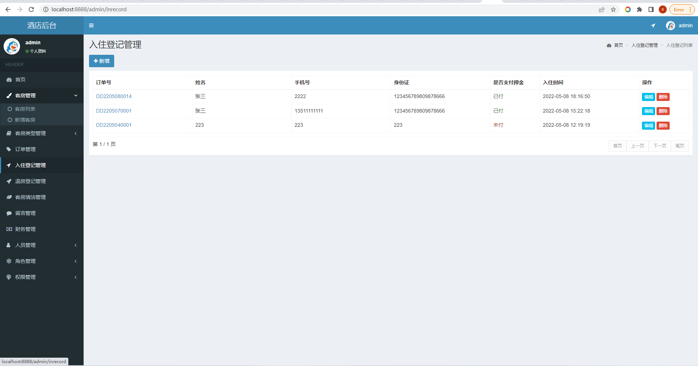
15-退房登记管理.png

16-客房清洁记录管理.png
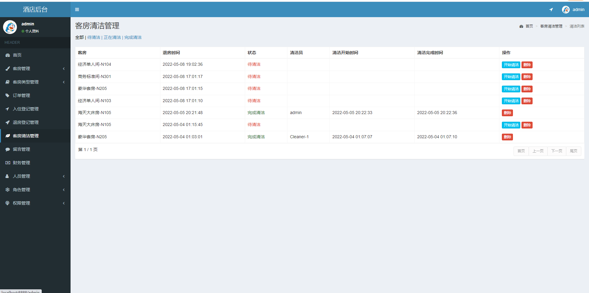
17-留言管理.png

18-财务管理.png

19-人员管理.png
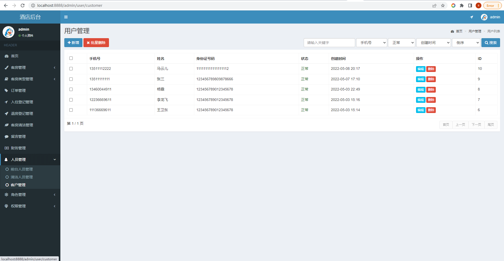
20-角色管理.png
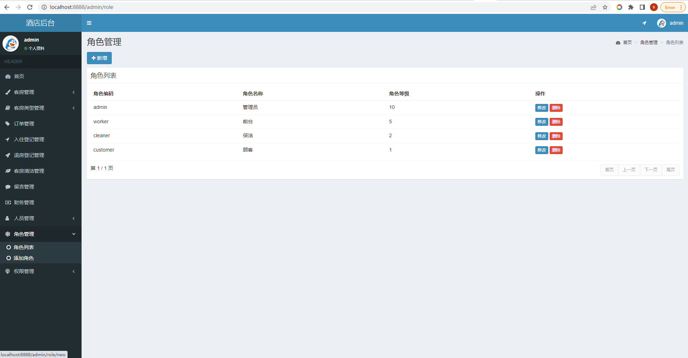

# 四、联系方式
需要完整代码联系博主，微信847064370

